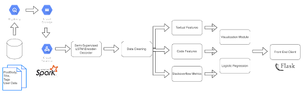
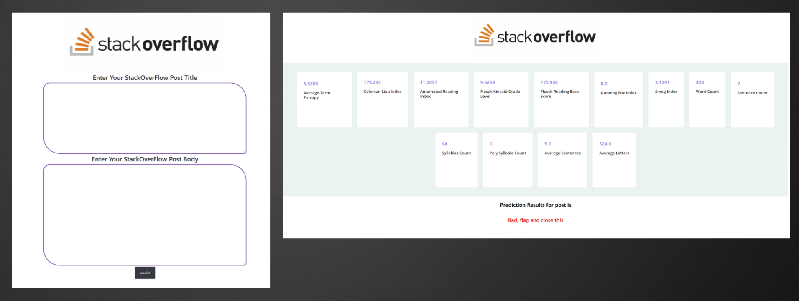

# BDA-FlaggedPostAnalysis


 [](https://travis-ci.org/github/BDA-FlaggedPostAnalysis)
[]()


[]()
[]()

[]()


## Big Data Analytics Project
## Flagged Post Analysis - Group 42

### Team Members:
1. Meghana Joshi (mmj2169)
2. Mohammed Aqid Khatkhatay (mk4427)
3. Shantanu Jain (slj2142)

### Introduction
The goal of this project is to analyze and identify the features of poor quality posts, so as to build an efficient and highly reliable machine learning model to classify posts on the basis of its quality.

Our project addresses this goal by utilizing techniques of data visualization to observe underlying patterns, feature selection and extraction to strengthen the classification model by feeding it with reliable features. The features that will be given as input to the model are a combination of user-based features, community-based features and textual features extracted from the body of the posts. 

### Repository Structure
```
BDA-FlaggedPostAnalysis:.
│   .gitignore
│   README.md
│   requirements.txt
│
├───dataset
│       posts_dataset.csv
│       test_data.csv
│
├───images
│       architecture.png
│       UI.PNG
│
└───src
    │   app.py
    │   helper.py
    │
    ├───cleaning_feature_extraction
    │       data_cleaning_feature_extraction.ipynb
    │
    ├───logistic_regression
    │       logistic_regression_model.ipynb
    │
    ├───model
    │       model.h5
    │
    ├───static
    │   └───images
    │           logo.png
    │
    └───templates
            home.html
            result.html

```

### Code documentation and organisation

~~~python
requirements.txt
"""
Contains the necessary enviroment and libraries needed to run this code.
"""
─dataset
"""
Contains the dataset used. Note large files were directly used on GCP
"""
-src
"""
Contains the flask application and jupyter notebooks
"""
~~~

### Instructions on running the application

~~~
git clone git@github.com:meghjoshii/BDA-FlaggedPostAnalysis.git

~~~

~~~python

!pip install requirements.txt
~~~

After installation make sure to run the flask application directly.
~~~
python app.py
~~~

Go to http://localhost:5000/ or whatever url it shows you on a browser

### Architecture Diagram


### Dataset
- Dataset obtained from StackExchange Data Dump containing 96M posts. 
 ~~~
 SOTorrent: Reconstructing and Analyzing the Evolution of Stack Overflow Posts.Permalink
Sebastian Baltes, Lorik Dumani, Christoph Treude, and Stephan Diehl.
Proceedings of the 15th International Conference on Mining Software Repositories (MSR 2018).
Acceptance rate: 33% (37/113).
~~~

- Uploaded the same on big query and used SQL queries for merging Posts, Users, Answers and Views together.


### Semi Supervised - LSTM Encoder Decoder
The model is trained on 60K
posts, and was used to label the rest of the data with an
accuracy of 84%. The LSTM model uses an SGD optimizer and categorical cross-entropy loss. After training the model on the training data for 25 epochs, accuracy of 84% was achieved. The new data was then
labeled using this model.

### Logistic Regression
Logistic Regression is mainly used for predicting binary labels based on logits (log of odds). We leveraged the pyspark logistic regression library for creating transformers and estimator for fitting our dataset. 

Applied a grid-based hyperparameter tuner to fetch the following parameters:

- Train Test split: 90:10
- Train Validation split: 80:20
- Training samples: 25849, Test samples: 2912
- Weight balancing ratio: 0.77
- regParam: 0.01
- elasticNetParam: 0.0
- fitIntercept: True

### Results

| Evaluation Metric      | Score |
| ----------- | ----------- |
| Accuracy      | 73%       |
| Area under ROC   | 0.71        |
| Area under PR   | 0.89       |
| F1-Score   | 0.73       |
| Cohen-Kappa Metric   | 0.26        |
| Mathews Correlation Coefficient   | 0.25  |

### Front End UI



### Conclusion
Based on the results and analysis undertaken, we believe that simply relying on textual evidence is not enough for classification. Since, we did not have previous flagged post data, that would have been a great feature to improve model performance. All in all, our analysis sheds light on the approaches that can be undertaken for large scale classification of flagged stack overflow posts. 
We have designed novel approaches to reduce the stackoverflow moderation queue size which will be useful in the long run.

### YouTube Link
https://www.youtube.com/watch?v=CDgAe_pxUHU

### References
```math
[1]  Annamoradnejad   I,   Fazli   M   and   Habibi   J   2020 Predicting Subjective Features from Questions
on QA Websites using BERT
Proc. of I6 th Int.   Conf.   on   Web   Research   (Iran) 
pp.   240-244.https://doi.org/1010.1109/ICWR49608.2020.9122318.
[2]   Baltes, S., Treude, C. and Diehl, S., 2019, May. Sotor-rent:  Studying the origin, evolution,
and usage of stackoverflow code snippets.
In 2019 IEEE/ACM 16th Inter-national  Conference  on
Mining  Software  Repositories(MSR) (pp. 191-194). IEEE.
[3]  Baltes, S., Dumani, L., Treude, C. and Diehl, S., 2018,May.
Sotorrent: Reconstructing and analyzing the evolu-tion of stack overflow posts.
In Proceedings of the 15th international conference on mining software repositories(pp. 319-330).
[4]   L. Ponzanelli, A. Mocci, A. Bacchelli, M. Lanza and D.Fullerton, "Improving Low Quality Stack Overflow PostDetection,"
2014 IEEE International Conference on Soft-ware  Maintenance  and  Evolution,  2014,  pp.  541-544,doi: 10.1109ICSME.2014.90
```
